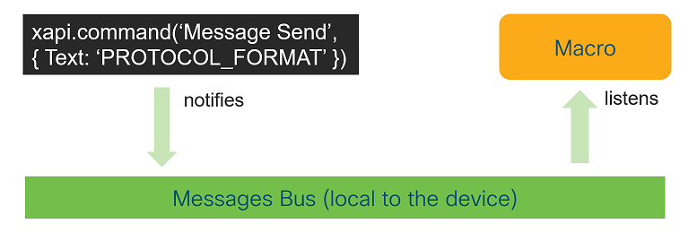
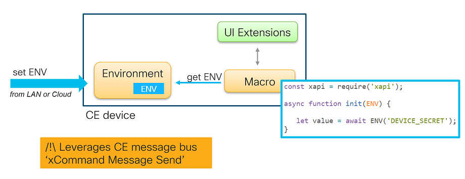

# Environment variables for Macros [](https://developer.cisco.com/codeexchange/github/repo/ObjectIsAdvantag/macros-env)

Enhance your Webex Devices Macro runtime with environment variables:
- ENV is shared across macros on the same device
- ENV can be volatile or persisted (by default)
- ENV can be modified over HTTP on the LAN 
- if cloud-registered, a device ENV can be modified over Webex /xapi endpoint)


## Usage

Wait for the 'env-ready' event and load variables for local ENV:

> note : there are multiple options when it comes to initializing a macro with ENV variables. Check the [example folder](examples/) for other coding styles and use cases.

```javascript
const xapi = require('xapi');

// Wait for ENV variables to be accesible
xapi.on('env-ready', async (ready) => {

   const value = await getenv('DEVICE_SECRET');

   xapi.command('UserInterface Message Prompt Display', {
      Title: 'ENV',
      Text: `$DEVICE_SECRET = ${value}`,
      Duration: 10
   });
   
});

//
// ENV library
//   - getenv() function
//
...
```


## Quickstart

1. Deploy the [environment](environment.js) macro to a device.

2. Activate the 'environment' macro.

3. Copy the [env-ready](env-ready.min.js) macro to the device, and activate it too.

   > You can pick either the minified or expanded version of 'env-ready'.

4. Check the logs in the Macro Editor, you should see:

   ```text
   08:22:00	[system]    Using XAPI transport: TSH
   08:22:00	[system]    Starting macros...
   08:22:00	environment Loading...
   08:22:00	getenv      Loading...
   08:22:02	getenv      Ready!
   08:22:02	environment Ready!
   08:22:02	environment'starting in persistent mode: environment variables are stored in the "ENV" macro.'
   08:22:03	getenv     'echo $DEVICE_SECRET = 1234'
   ```


5. Congrats, your ENV is working!

   You can now copy the [env-ready](env-ready.min.js) code snippet to an existing macro,
   and initialize your macro from the `xapi.on('env-ready', async (ready) => { ... })` code block.
   Check the [examples folder](examples/) for inspiration.

   _Note that if a variable is not found in ENV, an empty value is returned._


## To go further

- **Customize the DEFAULT_ENV** with a predefined the list of ENV variables for your macros in [environment](environment.js):

   ```javascript
   const DEFAULT_ENV = {
      'DEVICE_SECRET': 2345,
      'WEBEX_TOKEN': "ABCDEFGHIJ"
   }
   ```


- **Configure your ENV to be volatile or persistent** by changing the value of volatile in in [environment](environment.js): 

   The environment is volatile by default.

   ```javascript
   const volatile = true; // set to false for persisted ENV variables
   ```
   
   When changed to persistent, a 'ENV' file will be automatically created with the contents of the DEFAULT_ENV. 
   The 'ENV' file is materialized by another macro on your device. 
   Refresh the Macro Editor to make the 'ENV' macro appear. 
   
   As you update the DEFAULT_ENV in the 'environment' macro, make sure to delete the 'ENV' macro in order to re-initialize the ENV of the device.


- **Create or update ENV variables** by sending a message on the LAN or from the cloud

   > Note: the commands below won't work if the communications via Message/Send/Text commands are encrypted (see below)

   ```shell
   # on the LAN: place your credentials
   curl --request POST '{{endpoint}}/putxml' \
        --header 'Content-Type: text/xml' \
        --header 'Authorization: Basic {{credentials}}' \
        --data-raw '<Command>
            <Message>
               <Send>
                  <Text>{'\''env'\'': '\''DEVICE_SECRET'\'', '\''operation'\'': '\''set'\'', '\''value'\'': 9876 }</Text>
               </Send>
            </Message>
         </Command>'
   ```


   ```shell
   # over the Cloud
   #  - replace the token with a Webex bot or admin token with the 'spark:xapi_commands' scope
   #  - paste the Webex identifier of your devices (from the Webex /devices API)
   curl --request POST 'https://api.ciscospark.com/v1/xapi/command/message.send' \
      --header 'Authorization: Bearer WEBEX_ACCESS_TOKEN' \
      --header 'Content-Type: application/json' \
      --data-raw '{
         "deviceId": "Y2lzY29FyazovL3VzL0RFVklDRS83MzYLTQ3OGEtOTMyNC0xZmZiNjNmMjQzNWU",
         "arguments": {
            "Text": "{'\''env'\'': '\''DEVICE_SECRET'\'', '\''operation'\'': '\''set'\'', '\''value'\'': 789}"
         }
      }'
   ```

- **Troubleshooting**

   Open the 'environment' macro, and change the value of `TRACE_MESSAGES` to `true` to trace the communications between the 'environment' and other macros.


## Architecture

### Background information

When deploying CE customizations, you may use one or several of the strategies below:
- inject secrets along the CI/CD pipeline [see diagram](img/deploy_cicd.png)
- dynamically load secrets from a Vault [see diagram](img/load_vault.png)
- or load secrets from the local device, which is the purpose of this project (see below)

### Architecture

This project uses the device local bus to enable communication across Macros.



Using a Pub/Sub pattern, your macro request an 'Environment' macro for the value of environment variables.




## Security concerns

The communications between the macros reading the ENV, and the 'environment' macro managing the ENV are send in clear text, via xCommand 'Message Send Text'.

As 'Message Send' events can be listened by code with an 'Integrator' role, this represents a potential vulnerability if secrets were to be stored in the env.

We recommend to enhance the security of your deployment by using one or both of: encrypted communications and encryption at rest.

### Encrypted communications

The 'environment' macro and 'getenv()' function support encrypted communications.

Turn on the encrypted boolean both the 'environment' macro and 'getenv()' function to start seeing the message flying as encrypted.

A 'secret-based' and symetric encryption implementation is provided in the proposed implementation.
Feel free to replace / enhance with a crypto algorithm that better meets your needs.


### Encryption at rest

If secrets are to be stored, we recommend you encrypt these secrets before passing them to the environment.

Check the xapi-samples for examples of [symetric](https://github.com/CiscoDevNet/xapi-samples/blob/master/macros/15-cipher.js) and [asymetric](https://github.com/CiscoDevNet/xapi-samples/blob/master/macros/16-encrypt-rsa.js) algorithms compatible with CE's macro runtime.

